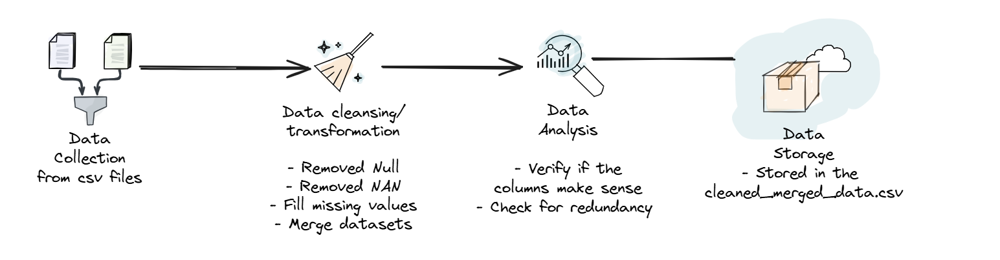

# ETL Pipeline for Terrorism and Country Data

This project implements an **ETL (Extract, Transform, Load)** pipeline that processes and cleans two datasets: global terrorism data and country data. The pipeline performs the following tasks:

1. **Extract**: Load raw CSV datasets from files.
2. **Transform**: Clean and preprocess the data by removing redundant columns, handling missing values, and merging datasets.
3. **Load**: Output the cleaned data and store it in a new CSV file.

The pipeline also includes **automated testing** using `pytest` and is integrated with **GitHub Actions** for continuous integration (CI).

## Table of Contents
1. [Project Overview](#project-overview)
2. [Datasets](#datasets)
3. [ETL Pipeline Details](#etl-pipeline-details)
4. [Testing and GitHub Actions](#testing-and-github-actions)
5. [Setup Instructions](#setup-instructions)
6. [Running the Pipeline](#running-the-pipeline)
7. [Running Tests](#running-tests)

## Project Overview

This project focuses on data preprocessing and merging for two main datasets:

- **Global Terrorism Dataset**: Contains information on terrorist attacks worldwide.
- **Country Data**: Contains demographic and geographical data for various countries.

### Features

- **Data Extraction**: Load data from CSV files.
- **Data Transformation**: Includes data cleaning and merging.
  - Remove columns with too many missing values.
  - Handle missing values in numerical and categorical columns.
  - Merge terrorism data with country information.
- **Automated Testing**: Uses `pytest` to verify the pipeline's correctness.
- **GitHub Actions**: Automated CI pipeline to run tests on every push to `main`.



## Datasets

### 1. **Global Terrorism Dataset**:
This dataset includes information on global terrorist activities such as attack type, location, fatalities, etc. Some columns in the dataset contain a lot of missing data, which are cleaned as part of the transformation process.

### 2. **Country Data**:
This dataset provides information about countries, such as:
- Population
- Capital cities
- Geographic details like latitude and longitude
- Currency codes
The country dataset is merged with the terrorism dataset to enrich the data.

### Files Involved:
- **`datasets/globalterrorism.csv`**: The raw terrorism dataset.
- **`datasets/world-data-2023.csv`**: The raw country dataset.
- **`cleaned_merged_data.csv`**: The output after cleaning and merging the datasets.

## ETL Pipeline Details

The pipeline is implemented in Python and utilizes the `pandas` library for data manipulation. The following steps are performed:

1. **Loading the Data**: 
   The `load_data` function loads the datasets into pandas DataFrames from CSV files.

2. **Cleaning the Data**:
   - Drop unnecessary columns from both the terrorism and country datasets.
   - Handle missing values:
     - **Numerical columns**: Filled with the median.
     - **Categorical columns**: Filled with the mode.
   - Rename the `country_txt` column in the terrorism dataset to `Country` to ensure consistency during merging.

3. **Merging the Data**:
   The `merge_dataframes` function merges the cleaned terrorism dataset with the country dataset using the `Country` column.

4. **Handling Duplicates**:
   The `handle_duplicates` function removes any duplicate rows from the merged dataset.

5. **Saving the Cleaned Data**:
   The cleaned and merged data is saved to the `cleaned_merged_data.csv` file.

## Testing and GitHub Actions

### 1. **Automated Tests**:
To ensure the correctness of the pipeline, automated tests are written using `pytest`. The tests cover:

- **Column names**: Ensure the expected columns are present in the datasets after cleaning.
- **Data cleaning**: Ensure that the columns are cleaned and missing values are filled correctly.
- **Data merging**: Verify that the terrorism and country datasets are merged correctly.

To run the tests locally:
```bash
pytest
```

## Setup Instructions

To set up and run this project locally:

1. **Clone the repository**:
   ```bash
   git clone https://github.com/your-username/CTW_etl_pipeline.git
   cd CTW_etl_pipeline
   ```
2. **Create the virtual environment**:
    ```bash 
    python -m venv .venv
    source .venv/bin/activate  # On Windows, use .venv\Scripts\activate
    ```
3. **Install dependencies**:
    ```bash
    pip install -r requirements.txt
    ```

## Running the Pipeline
To run the ETL pipeline locally:

1. **Ensure the virtual environment is activated**.

2. **Run the pipeline** using the following command:
   ```bash
   python src/main.py
   ```
   This will trigger the ETL process:
    
    * **Extract** data from the raw datasets.
    * **Transform** the data by cleaning, handling missing values, and merging the datasets.
    * **Load** the cleaned and merged data into a new file `cleaned_merged_data.csv`.

## Running Tests

To run the automated tests locally using pytest, follow these steps:

1. Make sure you've set up your virtual environment and installed the dependencies as described above.
2. Run the tests:
    ```bash
    pytest test_etl_pipeline.py
    ```

The tests will verify if the pipeline is working correctly, including:
* Ensuring the correct columns are present.
* Verifying data cleaning procedures.
* Ensuring data merging is correct.